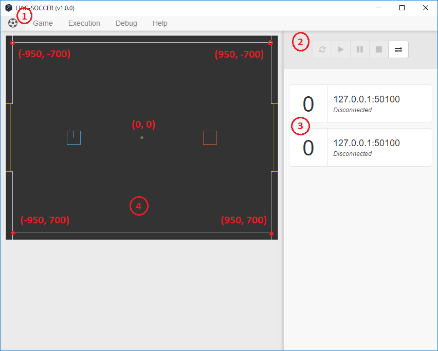

===============
Getting Started
===============

Installation
------------

Liac soccer does not require any installation, just download the latest release at

https://github.com/renatopp/liac-soccer/releases

unzip, and run the `liac-soccer.exe` executable or any other executable according to your platform.

If your platform is not supported or you want to run from the source code, please follow :doc:`development`.

Interface
---------

1. The **menu bar** (at the top of the problem) contains all possible commands and options in the liac-soccer:

  - *New Game*: starts a new game closing all connections (all bots will be disconnected) and reseting the all game progress.
  - *Invert Players*: inverts the robots of the connected players. Cannot be used during the game, you must stop it before inverting the players.
  - *Play*: starts a game, can only be used with two players connected.
  - *Pause*: pauses a running game, press play to continue.
  - *Stop*: stops the game and reset the score counting.
  - *Reset Ball*: resets the ball position and the robots positions.
  - *Toggle robot @ sensors*: shows or hides the robots sensors visualization. Each robot has 24 distance sensors, starting a 0 degrees and stepping at each 15 degrees until a complete loop around the robot.

2. **Command bar** is a shortcut for the game control.
3. The **info bar** shows the score, name and status of the players. If a player is not connected, shows the host and port for client connections instead.
4. **Canvas** is where you can see the game running. The game field has the size of 2000wx1000h units (about 20x10 meters), the robots have 100 units (or 1 meter).

