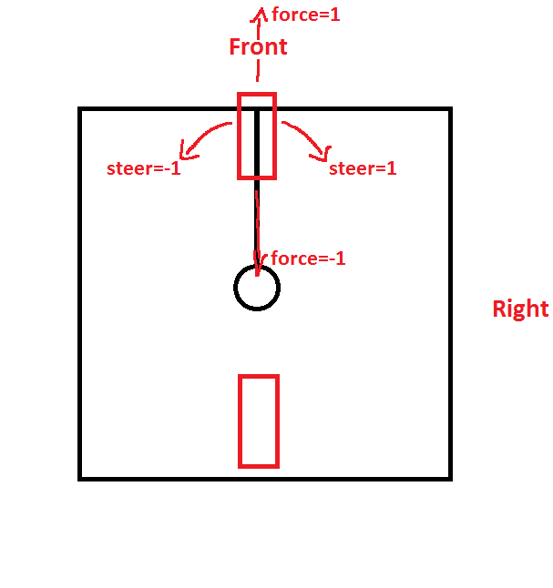
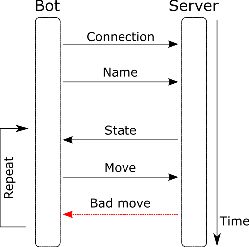

=====================
Making your First Bot
=====================

Getting the base bot
--------------------

To implement a new bot, it is recommended that you start with a base bot. Please take a look at the repository for a reference implementation:

https://github.com/renatopp/liac-soccer/tree/master/clients/python

In general, a your bot will inherit the base bot and override the `act` method and returning a movement. For instance, take the python bot below.

Robot properties
----------------

The figure above is an annotated representation of the liac-soccer robot. The robot's chassis (in black) is has about 1 meter (or 100px) of width and 1 meter of height, weighting 10Kg. The robots have 2 wheels and only the frontal wheel is used to control them.

The front wheel can receive a force power between -1 and 1, where -1 moves the robot backwards, 1 moves the robot forward, and 0 is idle. Notice that moving backward reduces the maximum speed of the robot.

This wheel can also receive a steer power between -1 and 1, where -1 turns the robot to the left, 1 turns the robot to the right, and 0 keeps the robot moving forward. Notice that, if your bot make fast changes between values (e.g., between 0 and 1), the robot wont move at all.

Communication
-------------

All communication between liac-soccer and bots is made using a simple TCP connection using JSON serialized messages. Your bot must respect the following communication flow:

1. Your bot must connect at `127.0.0.1:50100` or any other configured address.
2. Your bot must send a **name** command, telling the server what is the name of your bot.
3. The server will send a **state** message, with the current game state.
4. Your bot must reply with a **move** message.
5. If there is something wrong with you movement, the server will send a **badmove** message, otherwise the server will send a new **state** message.
6. Return the last step until interrupted.

Name message
~~~~~~~~~~~~

The name command have the following format::

    {
      "name": "<bot name here>"
    }

The server wont reply this, but you can see the result in the liac-soccer server.

State message
~~~~~~~~~~~~~

The state message have the following format::

    {
      "type": "state",
      "turn": "<string random code>",
      "ball": {
        "x": <number>,
        "y": <number>
      },
      "opponent": <same as player>,
      "player": {
        "score": <number>,
        "angle": <number>,
        "position": {
          "x": <number>,
          "y": <number>
        },
        "goal": {
          "x": <number>,
          "y": <number>
        },
        sensors: {
          0: <number>,
          15: <number>,
          30: <number>,
          45: <number>,
          60: <number>,
          75: <number>,
          90: <number>,
          105: <number>,
          120: <number>,
          135: <number>,
          150: <number>,
          165: <number>,
          180: <number>,
          195: <number>,
          210: <number>,
          225: <number>,
          240: <number>,
          255: <number>,
          270: <number>,
          285: <number>,
          300: <number>,
          315: <number>,
          330: <number>,
          345: <number>
        }
      }
    }

where:

- **type**: the type of the message, fixed to `"state"`.
- **turn**: a random string used to verify synchrony between bots and server.
- **ball**: a dict with the ball position.
- **opponent**: same as player info, but for the other robot, see below.
- **player**: the info about the robot that your bot controls:

  - *score*: your bot score.
  - *angle*: the angle in degrees your robot.
  - *position*: a dict with the robot's position.
  - *goal*: a dict with your goal position (the goal that you must defend).
  - *sensors*: a dict with distance sensor reading.

Move message
~~~~~~~~~~~~

Your move message must follow the format::

    {
      "force": <number>,
      "steer": <number>
    }

where:

- **force**: force to apply to the front wheel, between -1 and 1 (1 forward and -1 backward).
- **steer**: direction to where the robot will turn, between -1 and 1 (1 right and -1 left).

Badmove message
~~~~~~~~~~~~~~~

If you send some wrong message to the server, it will return an error message following the format::

    {
      "type": "badmove",
      "motive": <number>,
      "message": "<error message>"
    }

where:

- **type**: the type of the message, fixed to `"badmove"`.
- **motive**: the error code, see below.
- **message**: the error message.

The server can send the following error codes (with their respective messages):

====  =============================================
Code                    Message
====  =============================================
   1  Invalid JSON string.
   2  Invalid turn.
   3  Invalid steer value, please provide a number.
   4  Invalid force value, please provide a number.
====  =============================================

Python example
--------------

As an implementation example, use this ball-following bot::

    import base
    import math

    class MyBot(base.BaseBot):
        # The bot name
        name = 'Ball follower'

        def act(self, state):
            # Get angle between robot and ball
            x = state['ball']['x'] - state['player']['position']['x']
            y = -state['ball']['y'] + state['player']['position']['y']
            th = state['player']['angle']
            angle = math.degrees(math.atan2(x, y)) - th
            
            # Normalize angle to keep it between -180 and 180
            while angle <= -180:
                angle += 360

            while angle > 180:
                angle -= 360

            # Compute the force and steer of the robot
            force = 1
            steer = math.tanh(4*angle/180) # uses a sigmoid to smooth the steer

            # Return the command movement
            return (force, steer)

    ## Run the robot
    MyBot().run()